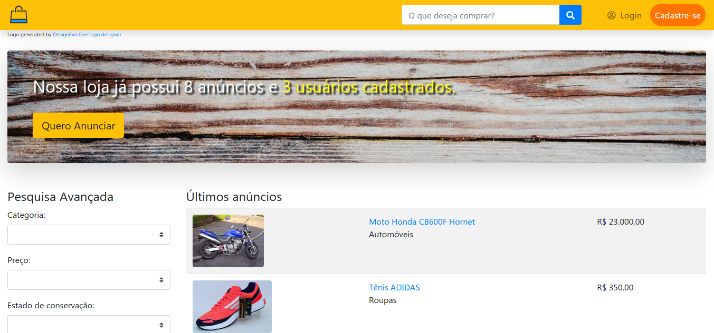

# OLFake

Loja virtual fictícia inspirada na OLX. Projeto feito durante os estudos de backend com PHP e manipulação de banco de dados SQL. Frontend feito com Bootstrap. Você pode visitar o site [clicando aqui](https://leofernandes.educationhost.cloud/)

As operações de CRUD permitem ao usuário criar uma conta, e com essa conta criar/editar/apagar anúncios, visualizar e comprar produtos de outros anunciantes, trocar senha/nome de usuário/foto de perfil e apagar conta.

Através de um sistema de filtragem é possível também pesquisar produtos por nome e filtrar por categoria, preço e estado de conservação. Além disso, é possível ver anúncios específicos de um determinado usuário, a data de criação de sua conta e último login feito na loja.

## Sobre o projeto

- [x] Orientado a Objetos.
- [x] Senhas criptografadas com md5 para armazenamento minimamente seguro.
- [x] Banco de dados relacional MySQL.
- [x] Bootstrap
- [x] Validações de formulários tanto no frontend quanto no backend
- [ ] MVC design pattern.

